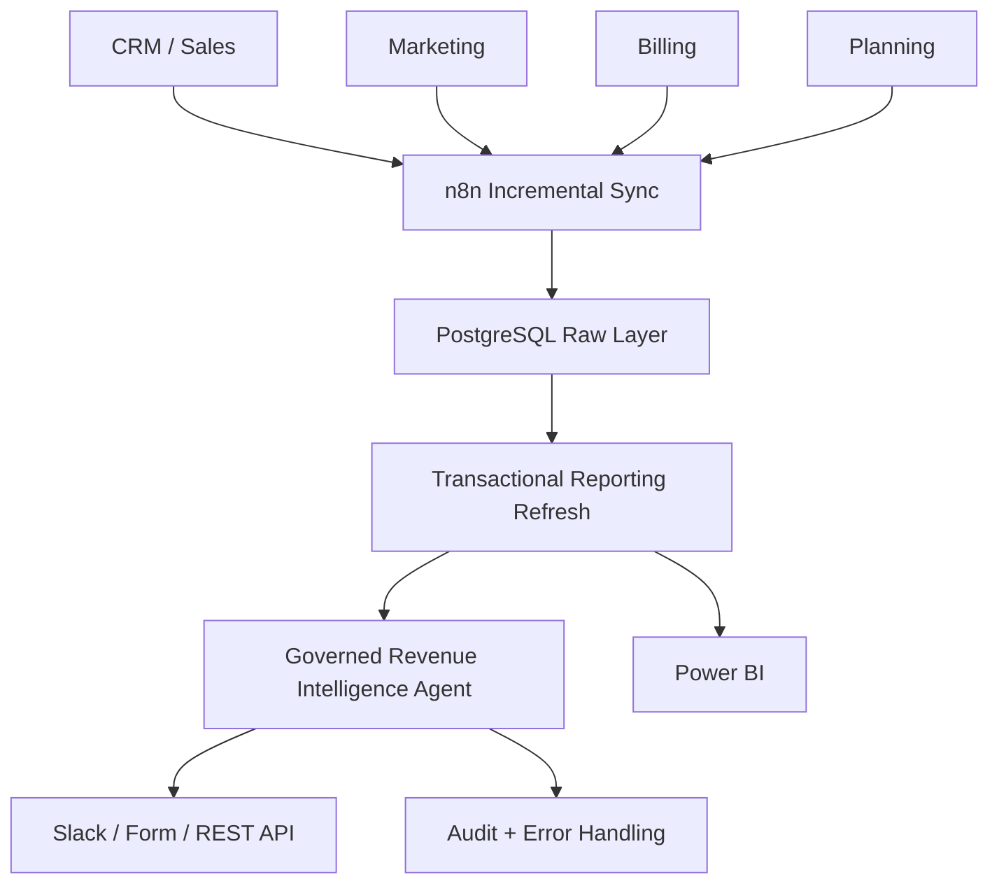
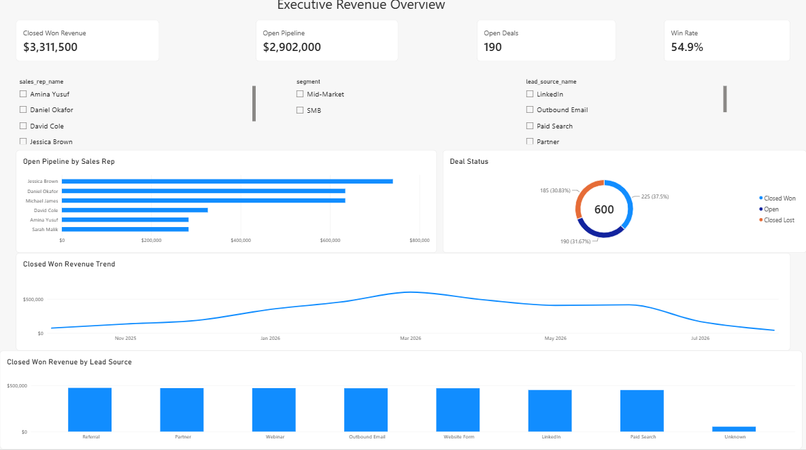
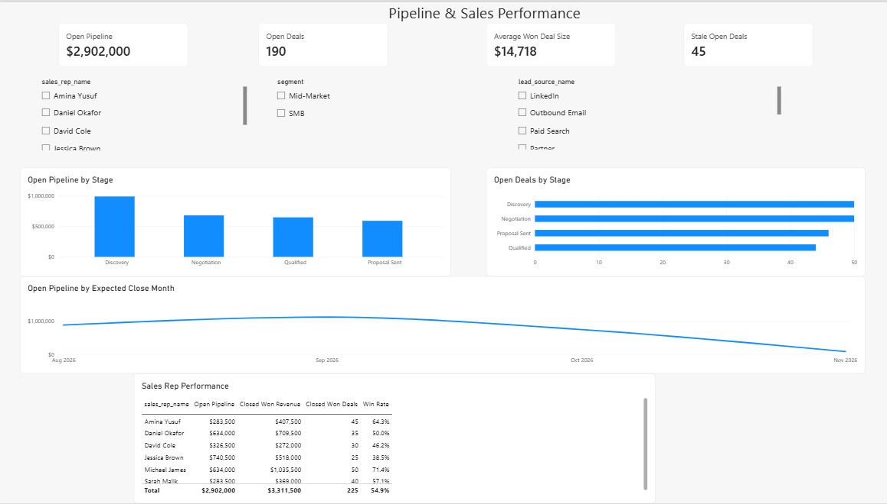
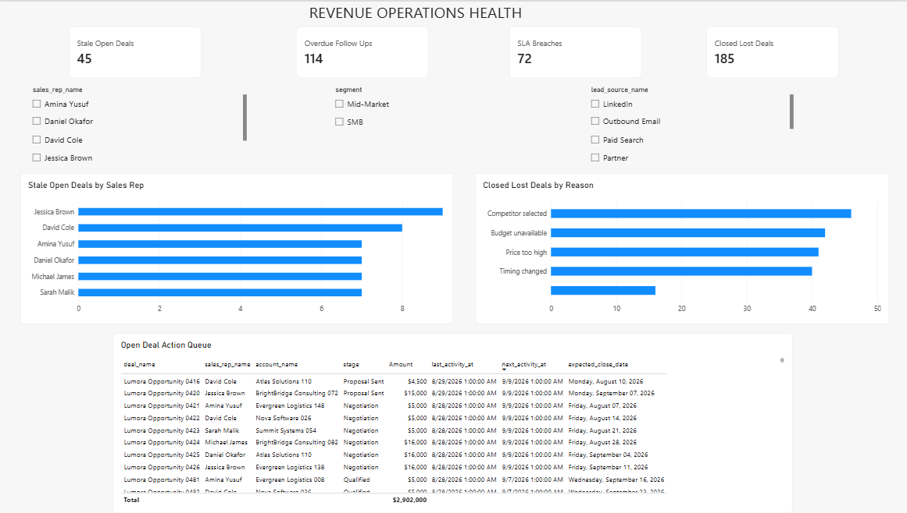

# Lumora Revenue Intelligence Production Simulation

Production-style Revenue Operations and Business Systems portfolio project for **Lumora Cloud**, a fictional B2B SaaS company.

> **Disclosure:** Lumora Cloud and all revenue/operational figures are simulated. The architecture, workflows, controls, tests, and outputs were built and verified in the simulation environment; they are not client-performance claims.

## What I Built
- Incremental synchronization across CRM, Marketing, Billing, and Planning.
- PostgreSQL raw, reporting, control, audit, and quality layers.
- Composite checkpointing with `(source_updated_at, primary_key)`.
- Ownership-safe checkpoint claim/release and failure recovery.
- Deterministic AI intent governance and approved SQL templates.
- Least-privilege PostgreSQL runtime roles.
- Slack, authenticated Form, REST API, and manual manager access.
- Full 10-entity orchestration with one reporting refresh after the successful batch.
- Three-page Power BI management dashboard.

## Architecture

**Security principle:** AI interprets intent. Deterministic controls authorize execution. PostgreSQL permissions enforce the final security boundary.

## Verified Simulation Results
| KPI | Result |
|---|---:|
| Total Deals | 600 |
| Closed Won Deals | 225 |
| Closed Lost Deals | 185 |
| Open Deals | 190 |
| Closed Won Revenue | $3,311,500 |
| Open Pipeline | $2,902,000 |
| Win Rate | 54.9% |
| Average Won Deal Size | $14,718 |
| Stale Open Deals | 45 |
| Overdue Follow Ups | 114 |
| SLA Breaches | 72 |

## Power BI

## Main Workflows
- `LUMORA-REVINT-01 | Manager Request Orchestrator`
- `LUMORA-REVINT-06 | Manager Form Gateway`
- `LUMORA-REVINT-SYS-01 | Error Handler`
- `LUMORA-SYNC-01 | Incremental Data Sync`
- `LUMORA-SYNC-02 | Entity Sync Worker | Production Callable`
- `LUMORA-SYNC-03 | Full Multi-Entity Sync Orchestrator`

## Documentation
- [Architecture](docs/architecture.md)
- [Security & Governance](docs/security.md)
- [Testing & Verification](docs/testing.md)
- [Power BI Dashboard](docs/powerbi-dashboard.md)
- [Portfolio Copy](docs/portfolio-copy.md)

## Links
- Portfolio: https://nikkytechies-portfolio.vercel.app/
- GitHub: https://github.com/Nikkypwetti
- Notion case study: https://app.notion.com/p/3cf8ac9858df81cd87d8c7d1317dedf3?pvs=204
